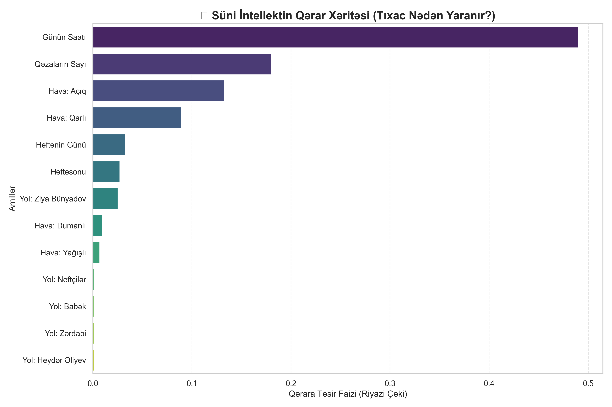
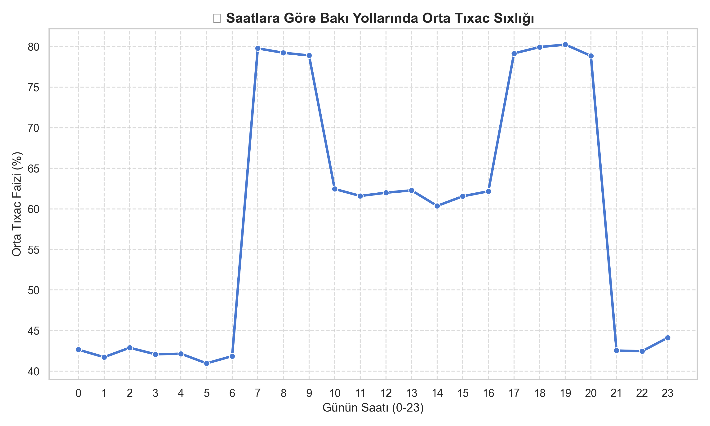
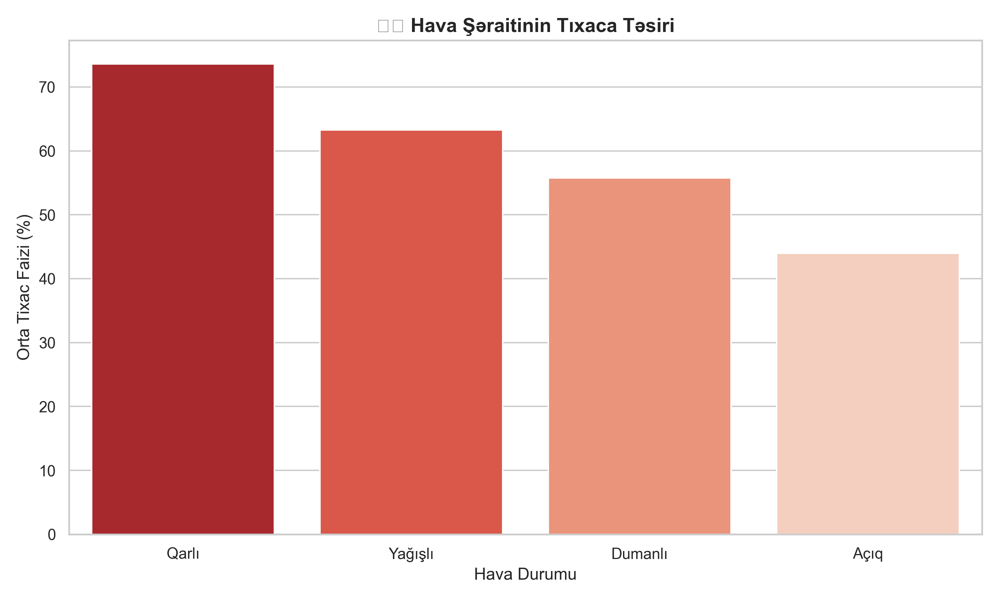
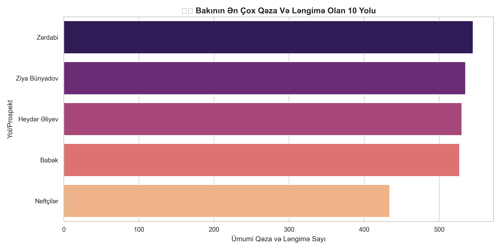

# 🚀 WayGo AI — Baku Urban Mobility Intelligence Engine


> **Bakı şəhərinin ağıllı nəqliyyat mühərriki.** Google Gemini AI, CatBoost (Yandex ML), LightGBM, XGBoost və Dijkstra Alqoritmini birləşdirən, real vaxtlı nəqliyyat tıxac proqnozu, dinamik naviqasiya və danışıq qabiliyyətli AI Agent sistemi.

---

## ⚡ Əsas İmkanlar

| Xüsusiyyət | Texnologiya | Dəqiqlik / Göstərici |
|---|---|---|
| 👑 Tıxac Proqnozu | CatBoost Regressor (Champion) | **89.48% R² Score** (MAE: 6.32%) |
| 🛡️ Overfitting Qorunması | 5-Fold Cross Validation + L1/L2 | **0.51% Overfitting Gap** |
| 🗺️ Ağıllı Naviqasiya | Dijkstra + ML Penalty Factor | 13 Düyməli Bakı Yol Qrafı |
| 💬 Danışan AI Agent | Google Gemini 1.5 Pro + RAG | 11 Yolun Radarları & Qaydaları |
| 📊 Data Vizualizasiyası | Seaborn + Matplotlib | 4 Avtomatlaşdırılmış Qrafik |
| 🔍 İzah Edilə bilən AI | XAI (Feature Importance) | Şəffaf Qərar Xəritəsi |
| 💚 Server Sağlamlığı | FastAPI `/health` & Logging | Gündəlik `.log` faylları |

---

## 🏆 5-Mühərrikli ML Dünya Çempionatı (Benchmark)

Bakı şəhərinin 10 əsas yolu üzərində 5 böyük Machine Learning alqoritmi yarışdırılmış və ən optimal model dondurulmuşdur:

| Model | Train R² | Test R² (Dəqiqlik) | Overfitting Gap | Test MAE | Status |
|---|---|---|---|---|---|
| **Random Forest** | `0.9123` | `0.8897` | `2.26%` | `6.39%` | ✅ Balanslı |
| **XGBoost** | `0.9012` | `0.8914` | `0.99%` | `6.43%` | ✅ Balanslı |
| **LightGBM** (Microsoft) | `0.9021` | `0.8936` | `0.85%` | `6.35%` | ✅ Balanslı |
| 🤝 **Voting Ensemble** | `0.9018` | `0.8941` | `0.77%` | `6.34%` | ✅ Balanslı |
| 👑 **CatBoost** (Yandex) | `0.8999` | **`0.8948` (89.48%)** 🏆 | **`0.51%`** 🎯 | **`6.32%`** | **✅ ÇEMPİON** |

---

## 📊 Analytics & XAI Dashboard (Qrafiklər)

### 1. 🧠 Süni İntellektin Qərar Xəritəsi (XAI Brain Map)


### 2. ⏰ Saatlara Görə Bakı Yollarında Tıxac Trendi


### 3. 🌦️ Hava Şəraitinin Tıxaca Təsiri


### 4. ⚠️ Bakının Ən Təhlükəli Və Ləngiməli Yolları


---

## 🏗️ Sistem Arxitekturası

```
Java Backend / Frontend (Mobile App)
         │
         ▼
   ┌─────────────┐
   │   main.py   │  ◄── FastAPI REST API (Port 8000, /health, /api/chat)
   └──────┬──────┘
          │
          ▼
   ┌─────────────────┐
   │  chatbot/       │
   │  agent.py       │  ◄── Gemini 1.5 Pro + RAG (knowledge_base.json)
   │  tools.py       │  ◄── Function Calling (ReAct Pattern)
   └──────┬──────────┘
          │
    ┌─────┴──────┐
    │            │
    ▼            ▼
┌──────────┐  ┌──────────────┐
│ml_models/│  │  routing/    │
│predict.py│  │ dijkstra.py  │
│(CatBoost)│  │ (13 Nodes)   │
└──────────┘  └──────────────┘
```

---

## 📁 Fayl Quruluşu

```
WayGo-AI/
├── main.py                   # FastAPI API Qapısı (Health Check + Chat Endpoints)
├── requirements.txt          # Bütün asılılıqlar (FastAPI, Gemini, CatBoost, LightGBM, XGBoost)
├── .env.example              # API açarı şablonu
│
├── chatbot/
│   ├── agent.py              # Gemini AI Agent (RAG + Function Calling)
│   ├── tools.py              # Fəsilə görə havanı təyin edən canlı alətlər
│   └── knowledge_base.json   # 11 Bakı yolu, radarlar, təcili nömrələr (RAG)
│
├── ml_models/
│   ├── data_generator.py     # 10 Bakı yolu üzrə 10,000 sətirlik data generatoru
│   ├── traffic_data.csv      # Təlim verilənlər bazası
│   ├── train_model.py        # Standart təlim skripti
│   ├── tune_model.py         # 5-Model Çempionatı + Overfitting/Underfitting analizi
│   ├── predict.py            # Real datetime ilə işləyən ML proqnoz funksiyası
│   └── traffic_model.pkl     # Çempion CatBoost modeli (Binar)
│
├── routing/
│   └── dijkstra.py           # 13 düyünlü Bakı yol qrafı + Dinamik ML çəkili Dijkstra
│
├── analytics/
│   ├── dashboard.py          # 3 analitik trend qrafikini generasiya edir
│   ├── explain_model.py      # XAI — Süni İntellektin Qərar Xəritəsini çəkir
│   └── *.png                 # GitHub-da görünən analitik qrafiklər
│
├── utils/
│   └── logger.py             # Mərkəzləşdirilmiş gündəlik `.log` izləmə sistemi
│
├── logs/                     # (Gitignore) Günlük log faylları
│
└── scripts/
    ├── test_chat.py          # İnteraktiv lokal test mühiti
    └── list_models.py        # Gemini API açarı yoxlayıcısı
```

---

## 🚀 Sürətli Başlanğıc (Quickstart)

### 1. Kitabxanaları Yüklə
```bash
pip install -r requirements.txt
```

### 2. API Açarını Qur
```bash
cp .env.example .env
# .env faylını açın və Gemini API key-i qeyd edin:
# GEMINI_API_KEY=sizin_gemini_api_key
```

### 3. ML Dünya Çempionatını İşə Sal Və Ən Güclü Modeli Seç
```bash
py ml_models/data_generator.py
py ml_models/tune_model.py
```

### 4. Serveri Qoş
```bash
py -m uvicorn main:app --host 0.0.0.0 --port 8000 --reload
```

### 5. Sağlamlıq Və Chat API-sini Yoxla
```bash
# Health Check
curl http://localhost:8000/health

# Chat Request
curl -X POST http://localhost:8000/api/chat \
  -H "Content-Type: application/json" \
  -d '{"message": "28 Maydan Əhmədliyə necə gedə bilərəm?", "session_id": "user_101"}'
```

---

## 🔗 REST API Endpointləri

| Endpoint | Method | Təsvir |
|---|---|---|
| `GET /` | `GET` | Servisin ümumi statusu və versiyası |
| `GET /health` | `GET` | Server və ML modelinin canlılıq yoxlanışı (Kubernetes/AWS) |
| `POST /api/chat` | `POST` | Java Backend-dən gələn sorğuları Gemini + ML + Dijkstra ilə cavablandırır |
| `POST /api/chat/stream` | `POST` | Frontend üçün Server-Sent Events (SSE) canlı streaming |

---

## 🛠️ Texnologiya Steki

- **LLM Agent:** Google Gemini 1.5 Pro (System Instructions + ReAct Tools)
- **Machine Learning:** CatBoost 1.2, LightGBM 4.7, XGBoost 3.4, Scikit-Learn 1.9
- **Optimization:** 5-Fold Cross Validation & Hyperparameter Grid Search
- **API Framework:** FastAPI + Uvicorn
- **Data & Analytics:** Pandas, NumPy, Matplotlib, Seaborn
- **Logging:** Python `logging` (UTF-8, Daily Rotation)

---

## 👥 Komanda Rolu Və Scope

Bu repozitoriya **WayGo** Startapının Süni İntellekt (AI & Data Science) Komandasına aiddir.

- 📌 **Scope:** Yalnız `WayGo-AI/` qovluğu (AI, ML, Routing, Analytics)
- 🔗 **Backend Əlaqəsi:** Java Spring Boot komandası ilə `POST /api/chat` vasitəsilə
- 🎨 **Frontend Əlaqəsi:** Flutter / React komandası ilə `/stream` vasitəsilə

---

*Son Yenilənmə: 2026-08-08 | WayGo AI Komandası*
